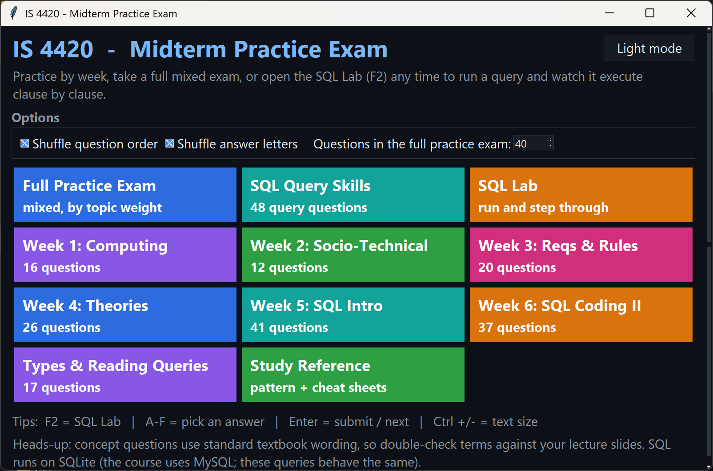
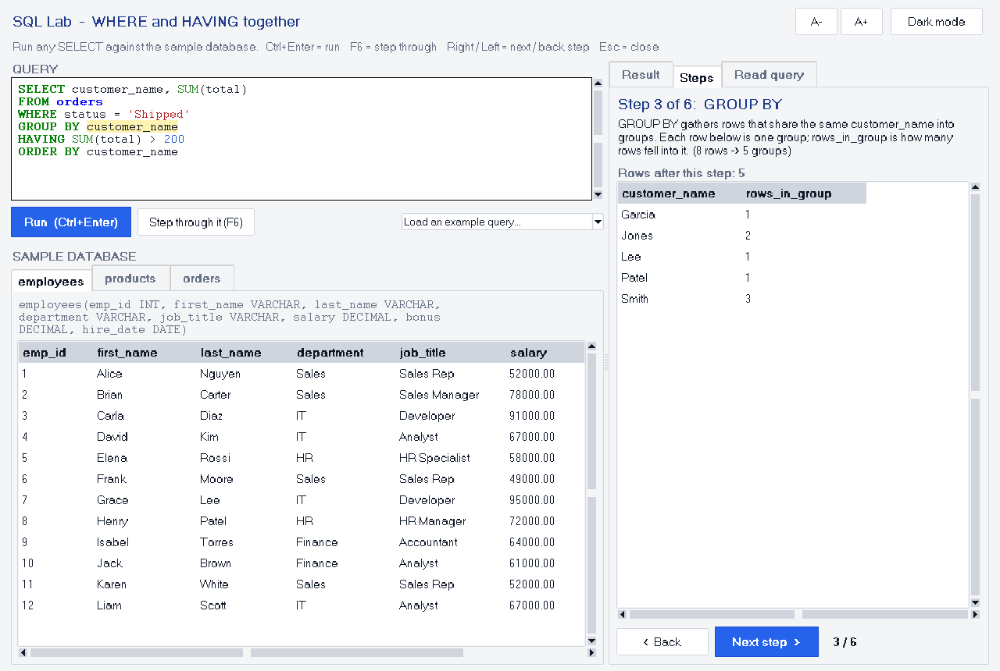
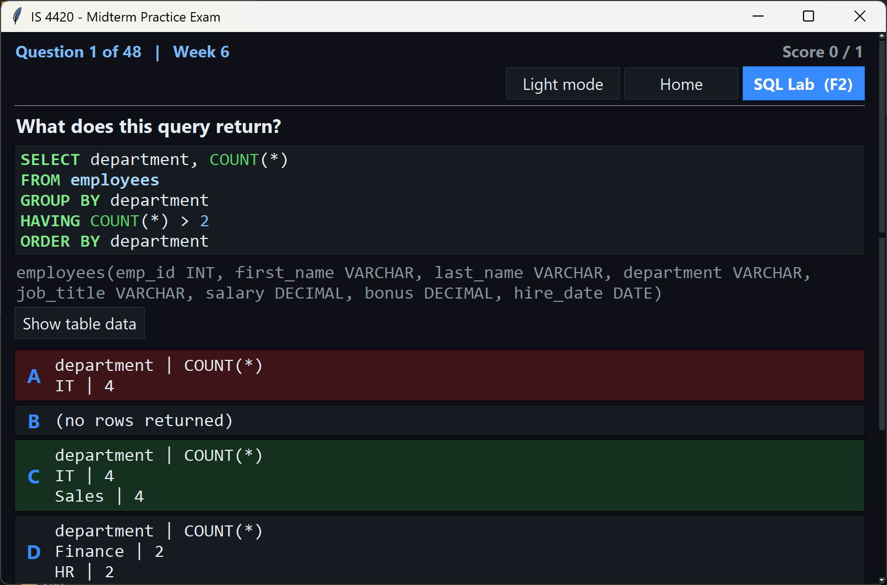
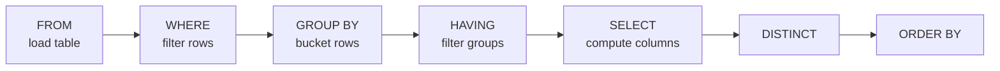
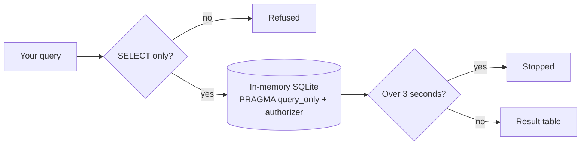

# IS 4420 – SQL Midterm Study Tool & SQL Lab

A database-course study app with ~170 practice questions and a built-in **SQL Lab** that shows how a query is executed, one clause at a time. One self-contained file; Python 3.8+ (Tkinter and SQLite ship with Python).



## Features
- Questions organized by study-guide week (computing, socio-technical systems, requirements, theories, SQL intro, SQL coding), or a mixed full practice exam
- **Every SQL answer is verified by actually running the query**: result-set choices are real output, not hand-typed
- **SQL Lab (F2):** run SELECT queries against a sample database (employees, products, orders), read a query in plain English, and **step through it clause by clause** to see the rows after each step
- Study reference (SELECT pattern, WHERE vs HAVING, LIKE, aggregates, keys), SQL syntax highlighting, light/dark mode

## Screenshots
| SQL Lab: stepping through GROUP BY | Feedback on a wrong answer |
|---|---|
|  |  |

## How the step-through works
SQL is written in one order but executed in another. The lab replays a query in **logical execution order** and shows the intermediate rows at each stage:



## Safe by design

No network access, no files read or written. SQL runs on SQLite; the course uses MySQL, and these query types behave the same.

## Run it
```bash
python IS4420_Midterm_Study_Tool.py
```
